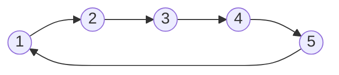

# 链表

## 1、josephus 约瑟夫问题

> 是一个出现在计算机科学和数据中的一个问题，又称：约瑟夫环，约瑟夫置换，丢手绢问题

### 1、问题来历

```
	据说著名犹太历史学家 Josephus有过以下的故事：在罗马人占领乔塔帕特后，39 个犹太人与Josephus及他的朋友躲到一个洞中，39个犹太人决定宁愿死也不要被敌人抓到，于是决定了一个自杀方式，41个人排成一个圆圈，由第1个人开始报数，每报数到第3人该人就必须自杀，然后再由下一个重新报数，直到所有人都自杀身亡为止。然而Josephus 和他的朋友并不想遵从。首先从一个人开始，越过k-2个人（因为第一个人已经被越过），并杀掉第k个人。接着，再越过k-1个人，并杀掉第k个人。这个过程沿着圆圈一直进行，直到最终只剩下一个人留下，这个人就可以继续活着。问题是，给定了和，一开始要站在什么地方才能避免被处决？Josephus要他的朋友先假装遵从，他将朋友与自己安排在第16个与第31个位置，于是逃过了这场死亡游戏。
```

### 2、问题

```
问题一：
	17世纪的法国数学家加斯帕在《数目的游戏问题》中讲了这样一个故事：15个教徒和15 个非教徒在深海上遇险，必须将一半的人投入海中，其余的人才能幸免于难，于是想了一个办法：30个人围成一圆圈，从第一个人开始依次报数，每数到第9个人就将他扔入大海，如此循环进行直到仅余15个人为止。问怎样排法，才能使每次投入大海的都是非教徒。
	
	
问题二：
	一堆猴子都有编号，编号是1，2，3 ...m，这群猴子（m个）按照1-m的顺序围坐一圈，从第1开始数，每数到第N个，该猴子就要离开此圈，这样依次下来，直到圈中只剩下最后一只猴子，则该猴子为大王。
```




### 3、java代码实现地址

[https://github.com/xiangyuqi22/java_study/blob/master/java/algorithm/src/main/java/com/study/algorithm/linkedlist/JosephusSignLinkedListDemo.java](https://github.com/xiangyuqi22/java_study/blob/master/java/algorithm/src/main/java/com/study/algorithm/linkedlist/JosephusSignLinkedListDemo.java)


