# 排序算法

[参考地址：https://www.cnblogs.com/guoyaohua/p/8600214.html](https://www.cnblogs.com/guoyaohua/p/8600214.html)

## 1、基础

排序也称排序算法（sort algorithm），排序是将一组数据依指定的顺序进行排列的过程

### 1.1、排序的分类

```
1、内部排序：
将需要处理的所有数据都加载到内部存储器中进行排序

2、外部排序
数据量过大，无法全部加载到内在中，需要借助外部存储进行排序

3、常见的排序算法
```


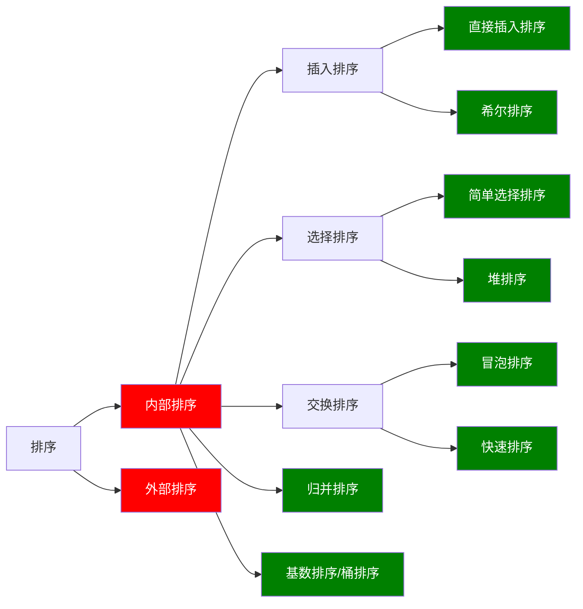

### 1.2、时间复杂度

```
度量一个程序（算法）执行时间的两种方法

1、事后统计法
	这种 方法可行，但是有两个问题：
		一是：要想对设计的算法的运行性能进行评测，需要实际运行该程序；
		二是：所得到时间的统计量依赖于计算机的硬件、软件等环境因素。这种方式要在同一台计算机的相同状态下运行，才能比较哪个算法速度更快

2、事前估算的方法
	通过分析某个算法的时间复杂度来判断哪个算法更优
```

```
时间频度：
	一个算法花费的时间与算法中语句的执行次数成正比，哪个算法中语句执行次数多，它花费的时间就越多。
	一个算法中的语句执行数称为语句频度或时间频度，记为T(n)
	

```


#### 1、时间频度

**举例说明**：
	比如计算1-100所有数据之和，设置两种算法

```java
//算法一：T(n) = n + 1
int total = 0;
int end = 100;
for(int i=1;i<=end;i++){
	total += i;
}

//算法二：T(n) = 1
total = (1+end)*end/2
```

算法的时间复杂度

##### 1、**忽略常数项**

|      | T(n)=2n+20 | T(n)=2*n | T(3n+10) | T(3n) |
| ---- | ---------- | -------- | -------- | ----- |
| 1    | 22         | 2        | 13       | 3     |
| 2    | 24         | 4        | 16       | 6     |
| 5    | 30         | 10       | 25       | 15    |
| 8    | 36         | 16       | 34       | 24    |
| 15   | 50         | 30       | 55       | 45    |
| 30   | 80         | 60       | 100      | 90    |
| 100  | 220        | 200      | 310      | 300   |
| 300  | 620        | 600      | 910      | 900   |

```
结论: 
2n+20 和 2n 随着n 变大，执行曲线无限接近, 20可以忽略
3n+10 和 3n 随着n 变大，执行曲线无限接近, 10可以忽略

```

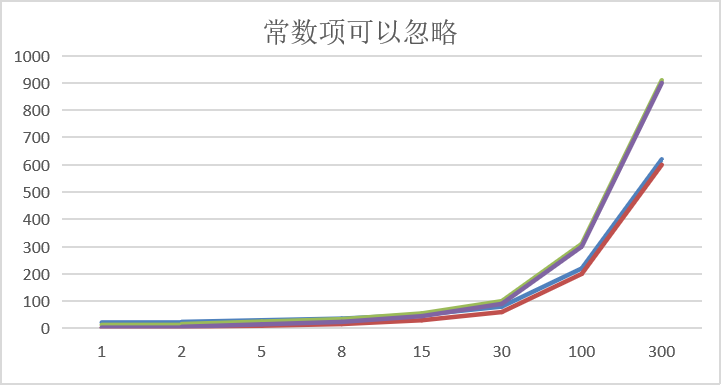


##### 2、忽略低次项

|      | T(n)=2n^2+3n+10 | T(2n^2) | T(n^2+5n+20) | T(n^2) |
| ---- | --------------- | ------- | ------------ | ------ |
| 1    | 15              | 2       | 26           | 1      |
| 2    | 24              | 8       | 34           | 4      |
| 5    | 75              | 50      | 70           | 25     |
| 8    | 162             | 128     | 124          | 64     |
| 15   | 505             | 450     | 320          | 225    |
| 30   | 1900            | 1800    | 1070         | 900    |
| 100  | 20310           | 20000   | 10520        | 10000  |

```
结论: 
2n^2+3n+10 和 2n^2 随着n 变大, 执行曲线无限接近, 可以忽略 3n+10
n^2+5n+20 和 n^2 随着n 变大,执行曲线无限接近, 可以忽略 5n+20
```

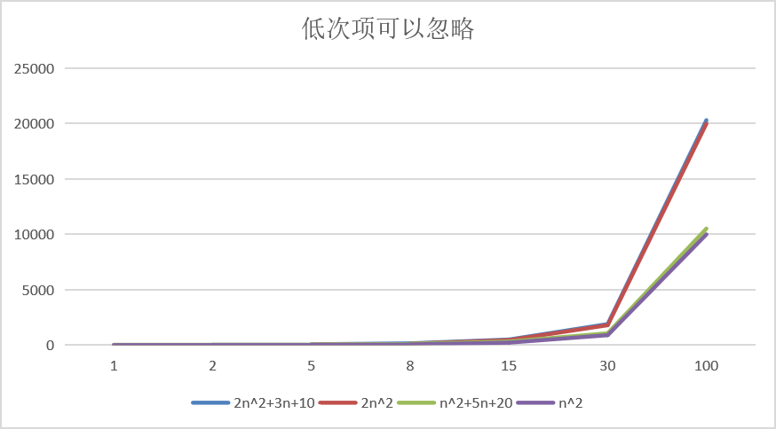

##### 3、忽略系数

|      | T(3n^2+2n) | T(5n^2+7n) | T(n^3+5n) | T(6n^3+4n) |
| ---- | ---------- | ---------- | --------- | ---------- |
| 1    | 5          | 12         | 6         | 10         |
| 2    | 16         | 34         | 18        | 56         |
| 5    | 85         | 160        | 150       | 770        |
| 8    | 208        | 376        | 552       | 3104       |
| 15   | 705        | 1230       | 3450      | 20310      |
| 30   | 2760       | 4710       | 27150     | 162120     |
| 100  | 30200      | 50700      | 1000500   | 6000400    |

```
结论: 
随着n值变大，5n^2+7n 和 3n^2 + 2n ，执行曲线重合, 说明  这种情况下, 5和3可以忽略。
而n^3+5n 和 6n^3+4n  ，执行曲线分离，说明多少次方式关键
```

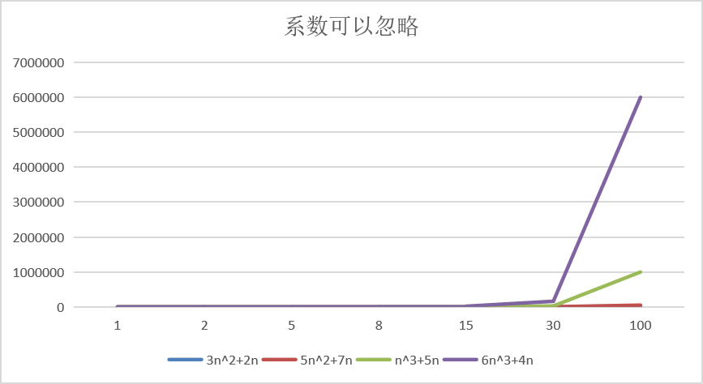


#### 2、时间复杂度

[参考：https://www.cnblogs.com/martini-d/p/fu-za-du.html](https://www.cnblogs.com/martini-d/p/fu-za-du.html)

```
一般情况下，算法中的基本操作语句的重复执行次数是问题规模n的某个函数，用T(N)表示。
若有某个辅助函数f(n)，使得当n走近于无穷大时，T(n)/f(n)的极限值为不等于零的常数，则称f(n)是T(n)的同数量级函数，记作T(n)=O(f(n))，称O(f(n))为算法的激进时间复杂度，称为时间复杂度。
```


```
T(n)不同，但是时间复杂度可能相同。如T(n)=n²+7n+6 与 T(n)=3n²+2n+2，它们的T(n)不同，但是时间复杂度都相同，都为O(n²)

计算时间复杂度的方法：
用常数1代替运行时间中的所有加法常数  T(n)=n²+7n+6  => T(n)=n²+7n+1
修改后的运行次数函数中，只保留最高阶项  T(n)=n²+7n+1 => T(n) = n²
去除最高阶项的系数 T(n) = n² => T(n) = n² => O(n²)

```

##### 1、常见的时间复杂度

```
1、常数阶O(1)
2、对数阶O(log2n)
3、线性阶O(n)
4、线性对数阶O(nlog2n)
5、平方阶O(n^2)
6、立方阶O(n^3)
7、k次方阶O(n^k)
8、指数阶O(2^n)
9、指数方阶O(n!)
```

```
说明：
常见的算法时间复杂度由小到大依次为：Ο(1)＜Ο(log2n)＜Ο(n)＜Ο(nlog2n)＜Ο(n2)＜Ο(n3)＜ Ο(nk) ＜Ο(2n) ，随着问题规模n的不断增大，上述时间复杂度不断增大，算法的执行效率越低
从图中可见，我们应该尽可能避免使用指数阶的算法
```

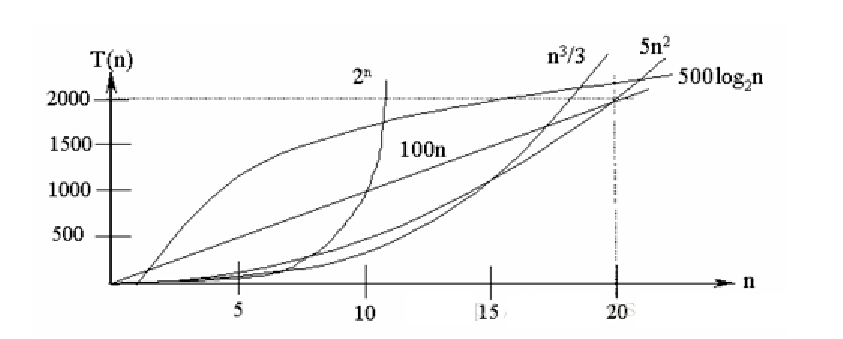


###### 1、常数阶O(1)

```java
//无论代码执行了多少行，只要是没有循环等复杂结构，那这个代码的时间复杂度就都是O(1)
int i = 100;
int j = 200;
i++;
++j;
int m = i + j;
//上述代码在执行的时候，它消耗的时候并不随着某个变量的增长而增长，那么无论这类代码有多长，即使有几万几十万行，都可以用O(1)来表示它的时间复杂度。
```

###### 2、对数阶O(logaN)

[对数[https://baike.baidu.com/item/%E5%AF%B9%E6%95%B0/91326?fr=aladdin](https://baike.baidu.com/item/对数/91326?fr=aladdin)](https://baike.baidu.com/item/%E5%AF%B9%E6%95%B0/91326?fr=aladdin)

如果a的x次方等于N（a>0，且a不等于1），那么数x叫做以a为底N的对数（logarithm），记作x=logaN。其中，a叫做对数的[底数](https://baike.baidu.com/item/底数/5416651)，N叫做[真数](https://baike.baidu.com/item/真数/20402544)。

```java
int m = 1;
int n  = 100;
while(m<n){
	m = m * 2;
}
/**
说明：在while循环里面，每次都将 m 乘以 2，乘完之后，m 距离 n 就越来越近了。假设循环x次之后，m 就大于 n 了，此时这个循环就退出了，也就是说 2 的 x 次方等于 n，那么 x = log2n也就是说当循环 log2n 次以后，这个代码就结束了。因此这个代码的时间复杂度为：O(log2n)  。 O(log2n) 的这个2 时间上是根据代码变化的
*/
```

###### 3、线性阶O(n)

```java
int n = 100;
int j = 0;
for (int i=1 ;  i <= n ; i++ ){
   j++;//辅助代码
}
/*
	这段代码，for循环里面的代码会执行n遍，因此它消耗的时间是随着n的变化而变化的，因此这类代码都可以用O(n)来表示它的时间复杂度
*/
```

###### 4、线性对数阶O(nlogaN)

```java
/*
	简单来说就是线性阶里面包含了一个对数阶
	线性对数阶O(nlogN) 其实非常容易理解，将时间复杂度为O(logn)的代码循环N遍的话，那么它的时间复杂度就是 n * O(logN)，也就是了O(nlogN)
*/
int n = 100;
for(m=1;m<n;m++){
    int i = 1;
    while(i<n){
        i = i*2;
    }
}
```

###### 5、平方阶O(n^2)

```java
/*
	平方阶O(n²) 就更容易理解了，如果把 O(n) 的代码再嵌套循环一遍，它的时间复杂度就是 O(n²)，这段代码其实就是嵌套了2层n循环，它的时间复杂度就是 O(n*n)，即  O(n²) 如果将其中一层循环的n改成m，那它的时间复杂度就变成了 O(m*n)
*/
int n = 100;
for(int i=0;i<n;i++){
    for(int j=0;j<n;j++){
        //逻辑代码
    }
}
```

###### 6、立方阶O(n^3)

###### 7、k次方阶O(n^k)

###### 8、指数阶O(2^n)

###### 9、指数方阶O(n!)

##### 2、平均/最坏时间复杂度

**平均时间复杂度**
	是指所有可能的输入实例均以等概率出现的情况下，该算法的运行时间。
	
**最坏时间复杂度**
	最坏情况下的时间复杂度称最坏时间复杂度。一般讨论的时间复杂度**均是最坏情况下的时间复杂度**。 这样做的原因是：**最坏情况下的时间复杂度是算法在任何输入实例上运行时间的界限，这就保证了算法的运行时间不会比最坏情况更长。**


说明：

- **稳定**：如果a原本在b前面，而a=b，排序之后a仍然在b的前面；
- **不稳定**：如果a原本在b的前面，而a=b，排序之后a可能会出现在b的后面；
- **内排序**：所有排序操作都在内存中完成；
- **外排序**：由于数据太大，因此把数据放在磁盘中，而排序通过磁盘和内存的数据传输才能进行；
- **时间复杂度：** 一个算法执行所耗费的时间。
- **空间复杂度**：运行完一个程序所需内存的大小。


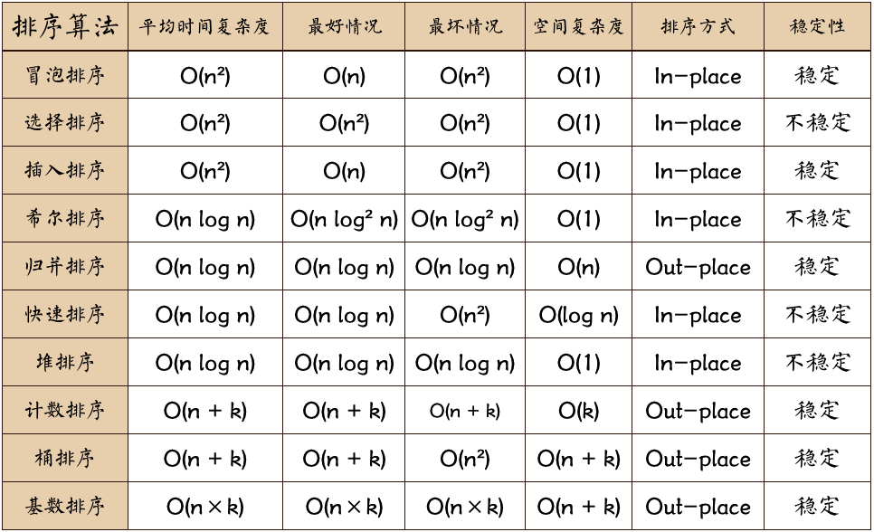


### 1.3、空间复杂度

1、类似于时间复杂度的讨论，一个算法的空间复杂度（space complexity）定义为该算法所耗费的存储空间，它也是问题规模n的函数。

2、空间复杂度是对一个算法在运行过程中临时占用存储空间大小的量度。有的算法需要战胜的时间工作单元数与解决问题的规模n有关，它随着n的增大而增大，当n较大时，将战胜较多的存储单元，例如快速排序和归并排序算法就属于这种情况。

3、在做算法分析时，**主要讨论的是时间复杂度**。从用户使用体验上看，更看重的是程序执行的速度。一些缓存产品(redis,memcache)和算法（基数排序）本质就是用空间换时间。


## 2、八种排序算法

### 1、交换排序

#### 1、冒泡排序

```
基本介绍

冒泡排序（Bubble Sorting）的基本思想是：通过对待排序序列从前向后（从下标较小的元素开始）,依次比较相邻元素的值，若发现逆序则交换，使值较大的元素逐渐从前移向后部，就象水底下的气泡一样逐渐向上冒。

因为排序的过程中，各元素不断接近自己的位置，如果一趟比较下来没有进行过交换，就说明序列有序，因此要在排序过程中设置一个标志flag判断元素是否进行过交换。从而减少不必要的比较。(这里说的优化，可以在冒泡排序写好后，在进行)

```


```java
//核心代码
	public void test3() {
		int[] arrs = new int[] {-2,-10,0,9,11,23,18,38,49,60};
		int count = 0;
		boolean flag = true;//
		for (int i = 1; i < arrs.length - 1; i++) {
			flag = true;
			for (int j = 0; j < arrs.length - i; j++) {
				count++;
				if(arrs[j] > arrs[j+1]) {
					int c = arrs[j];
					arrs[j] = arrs[j+1];
					arrs[j+1] = c;
					flag = false;
				}
			}
			if(flag) {
				//如果循环之后，没有一次数值替换，那么直接中断冒泡
				break;
			}
		}
		System.out.println("计算次数：" + count);
		System.out.println(Arrays.toString(arrs));
	}
```


#### 2、选择排序

```
选择式排序也属于内部排序法，是从欲排序的数据中，按指定的规则选出某一元素，再依规定交换位置后达到排序的目的。

选择排序思想:

选择排序（select sorting）也是一种简单的排序方法。
	它的基本思想是：
		第一次从arr[0]~arr[n-1]中选取最小值，与arr[0]交换，
		第二次从arr[1]~arr[n-1]中选取最小值，与arr[1]交换，
		第三次从arr[2]~arr[n-1]中选取最小值，与arr[2]交换，…，
		第i次从arr[i-1]~arr[n-1]中选取最小值，与arr[i-1]交换，…, 
		第n-1次从arr[n-2]~arr[n-1]中选取最小值，与arr[n-2]交换，总共通过n-1次，得到一个按排序码从小到大排列的有序序列。


```

```java
	public void selectionSortTest() {
		int[] arrs = new int[] {-2,-10,0,9,11,23,18,38,49,60,9};
		int index = 0;
		for (int i = 0; i < arrs.length - 1; i++) {
			index = i;
			for (int j = i + 1; j < arrs.length ; j++) {
				if(arrs[index] > arrs[j]) {
					index  = j;
				}
			}
			if(index != i) {
				int temp = arrs[index];
				arrs[index] = arrs[i];
				arrs[i] = temp;
			}
		}
	}
```

#### 3、插入排序

```
插入排序法介绍:

	插入式排序属于内部排序法，是对于欲排序的元素以插入的方式找寻该元素的适当位置，以达到排序的目的。

插入排序（Insertion Sorting）的基本思想是：
	把n个待排序的元素看成为一个有序表和一个无序表，开始时有序表中只包含一个元素，无序表中包含有n-1个元素，排序过程中每次从无序表中取出第一个元素，把它的排序码依次与有序表元素的排序码进行比较，将它插入到有序表中的适当位置，使之成为新的有序表。
```

```java
public void insertionSortTest2() {
		int[] arrs = new int[] { -2, -10, 0, 9, 11, 23, 18, 38, 49, 60, 9 };
		int indexVal = 0;
		int index = 0;
		for (int i = 1; i < arrs.length; i++) {
			indexVal = arrs[i];// 从第二个数开始，因为第一个数据不需要比，默认就是有序
			index = i - 1;// 从第一个数开始进行比较
			while (index >= 0 && indexVal < arrs[index]) {
				arrs[index + 1] = arrs[index];
				index--;
			}
			// 此时获取的index的值比当前indexVal小
			arrs[index + 1] = indexVal;
		}
	}
```

#### 4、希尔排序

```

希尔排序是希尔（Donald Shell）于1959年提出的一种排序算法。希尔排序也是一种插入排序，它是简单插入排序经过改进之后的一个更高效的版本，也称为缩小增量排序。

希尔排序法基本思想
	希尔排序是把记录按下标的一定增量分组，对每组使用直接插入排序算法排序；随着增量逐渐减少，每组包含的关键词越来越多，当增量减至1时，整个文件恰被分成一组，算法便终止


```


```java
//使用插入排序
	public void shellSortTest3() {
		int[] arrs = new int[] { 8, 9, 1, 7, 2, 3, 5, 4, 6, 0 };
		int length = arrs.length;// length = 5
		int currentValue = 0;
		int index = 0;
		while ((length = length / 2) != 0) {
			for (int i = length; i < arrs.length; i++) {
				currentValue = arrs[i];//arrs[5] = 3
				index = i - length; //0
				while(index >= 0 && currentValue < arrs[index]) {
					arrs[index + length] = arrs[index];
					index -= length;
				}
				arrs[index + length] = currentValue;
			}
		}		
	}
```

#### 5、快速排序

```
快速排序（Quick Sort）
快速排序的基本思想：
	通过一趟排序将待排记录分隔成独立的两部分，其中一部分记录的关键字均比另一部分的关键字小，则可分别对这两部分记录继续进行排序，以达到整个序列有序。

算法描述
	快速排序使用分治法来把一个串（list）分为两个子串（sub-lists）。具体算法描述如下：

	从数列中挑出一个元素，称为 “基准”（pivot）；
	重新排序数列，所有元素比基准值小的摆放在基准前面，所有元素比基准值大的摆在基准的后面（相同的数可以到任一边）。在这个分区退出之后，该基准就处于数列的中间位置。这个称为分区（partition）操作；
	递归地（recursive）把小于基准值元素的子数列和大于基准值元素的子数列排序。
```

```java
	//快速排序核心代码
	private void quickSort1(int[] arrs, int left, int right) {
		int l = left;
		int r = right;
		int pivot = arrs[(left+right)/2];
		int temp;
		while(l < r) {
			//从左边开始找到大于或等于基准值的数
			while(arrs[l] < pivot) {
				l++;
			}
			//从右边开始，找到小于或等于基准值的数
			while(arrs[r] > pivot ) {
				r--;
			}
			if(l >= r) {
				//如果左边的指针超过了右边的指针，表示所有数据都找好了，可以结束循环
				break;
			}
			//找到了可替换的数据，可以进行交换了
			temp = arrs[l];
			arrs[l] = arrs[r];
			arrs[r] = temp;
			
			//如果刚刚右边找到的数据跟基准值是一样的，为了防止死循环，那么右边的指针需要向左移动一下
			if(arrs[r] == pivot) {
				//上面数据交换时，已经将右边的数据替换到了左边
				l++;
			}
			if(arrs[l] == pivot) {
				r--;
			}
		}
		if(l == r) {
			l++;
			r--;
		}
		if( r > left) {
			quickSort1(arrs, left, r);
		}
		if(l < right) {
			quickSort1(arrs, l, right);
		}
	}
```

#### 6、归并排序

```
归并排序介绍:

	归并排序（MERGE-SORT）是利用归并的思想实现的排序方法，该算法采用经典的分治（divide-and-conquer）策略（分治法将问题分(divide)成一些小的问题然后递归求解，而治(conquer)的阶段则将分的阶段得到的各答案"修补"在一起，即分而治之)。
	
	
归并排序思想示意图1-基本思想:
说明:
	可以看到这种结构很像一棵完全二叉树，本文的归并排序我们采用递归去实现（也可采用迭代的方式去实现）。分阶段可以理解为就是递归拆分子序列的过程。
```

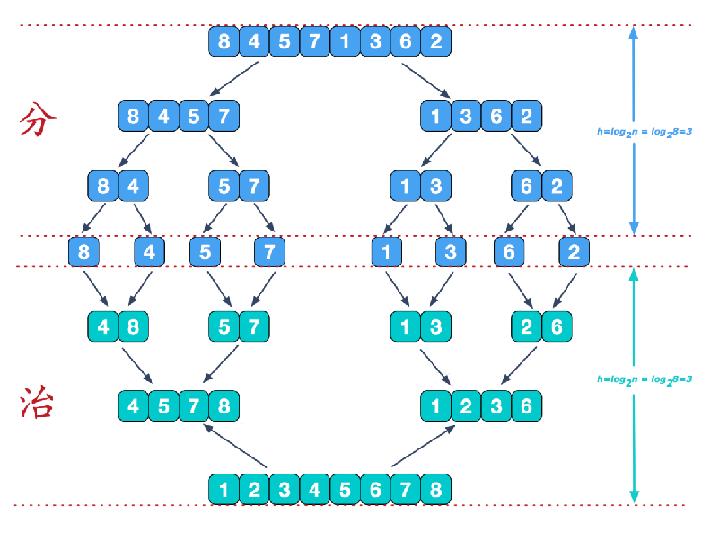

```
我们需要将两个已经有序的子序列合并成一个有序序列，比如上图中的最后一次合并，要将[4,5,7,8]和[1,2,3,6]两个已经有序的子序列，合并为最终序列[1,2,3,4,5,6,7,8]，来看下实现步骤
```

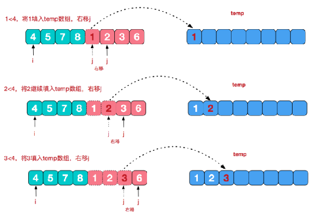

```java
/**
	 * mergeSort:(归并排序：分)
	 * @author xiangning
	 *
	 * @param arrs	原始数据
	 * @param left	最左边索引
	 * @param right	最右边索引
	 * @param tempArrs	临时数组，需要占用额外空间
	 */
	private void mergeSort(int[] arrs,int left,int right,int[] tempArrs) {
		if(left < right) {
			int mid = (right-left)/2 + left;
			//向左递归分解
			mergeSort(arrs, left, mid,tempArrs);
			//向右递归分解
			mergeSort(arrs, mid+1, right,tempArrs);
			//合并排序
			mergeSort(arrs, left, right,mid,tempArrs);
		}
	}
	
	/**
	 * mergeSort:(归并排序：合)
	 * @author xiangning
	 *
	 * @param arrs	原始数据	
	 * @param left	左起索引
	 * @param right	最右边索引
	 * @param mid	中分
	 * @param tempArrs	临时数组
	 */
	private void mergeSort(int[] arrs,int left,int right,int mid,int[] tempArrs) {
		int index = 0;
		int j = mid+1;
		for (int i = left; i <= mid; i++) {
			while(j <= right && arrs[j] < arrs[i]) {
				tempArrs[index++] = arrs[j++];
			}
			tempArrs[index++] = arrs[i];
		}
		if(j<=right) {
			for (int i = j; i <=right; i++) {
				tempArrs[index++] = arrs[i];
			}
		}
		for (int i = 0; i < index; i++) {
			arrs[left + i] = tempArrs[i];
		}
	}
```

#### 7、桶排序(基数排序)

```
Radix Sort
基数排序(桶排序)介绍:

基数排序（radix sort）属于“分配式排序”（distribution sort），又称“桶子法”（bucket sort）或bin sort，顾名思义，它是通过键值的各个位的值，将要排序的元素分配至某些“桶”中，达到排序的作用

基数排序法是属于稳定性的排序，基数排序法的是效率高的稳定性排序法

基数排序(Radix Sort)是桶排序的扩展

基数排序是1887年赫尔曼·何乐礼发明的。它是这样实现的：将整数按位数切割成不同的数字，然后按每个位数分别比较。


基数排序基本思想

将所有待比较数值统一为同样的数位长度，数位较短的数前面补零。然后，从最低位开始，依次进行一次排序。这样从最低位排序一直到最高位排序完成以后, 数列就变成一个有序序列。

这样说明，比较难理解，下面我们看一个图文解释，理解基数排序的步骤
```


基数排序图文说明
将数组 {53, 3, 542, 748, 14, 214} 使用基数排序, 进行升序排序。

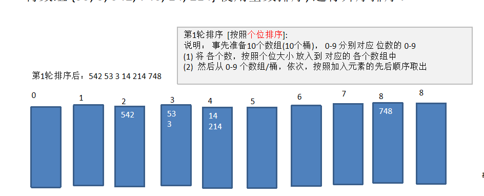

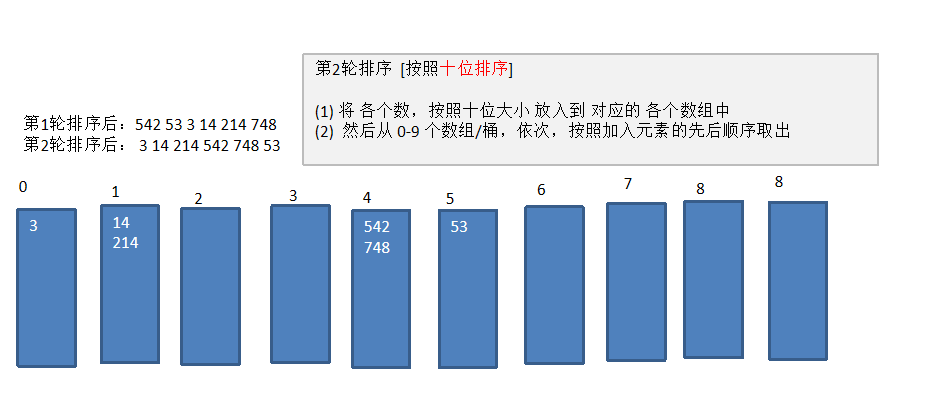

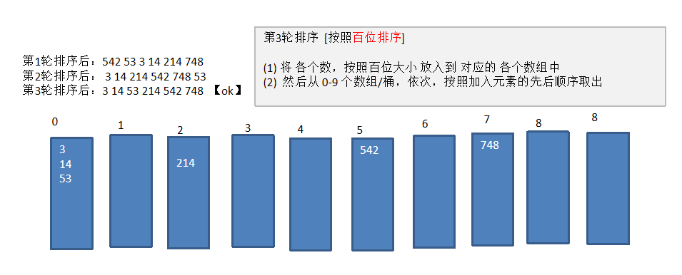

```
基数排序代码实现

要求：将数组 {53, 3, 542, 748, 14, 214 } 使用基数排序, 进行升序排序
思路分析：前面的图文已经讲明确

基数排序的说明:
    1、基数排序是对传统桶排序的扩展，速度很快.
    2、基数排序是经典的空间换时间的方式，占用内存很大, 当对海量数据排序时，容易造成 OutOfMemoryError 。
    3、基数排序时稳定的。[注:假定在待排序的记录序列中，存在多个具有相同的关键字的记录，若经过排序，这些记录的相对次序保持不变，即在原序列中，r[i]=r[j]，且r[i]在r[j]之前，而在排序后的序列中，r[i]仍在r[j]之前，则称这种排序算法是稳定的；否则称为不稳定的]
    有负数的数组，我们不用基数排序来进行排序, 如果要支持负数，参考: https://code.i-harness.com/zh-CN/q/e98fa9 

```

```java
	//核心代码
	private void radixSort(int[] arrs) {
		int k = 10;//10个桶
		//创建10个桶用来装数据
		int[][] bucket = new int[k][arrs.length];
		//创建一个数组来记录每个桶的数据
		int[] bucketLengthCounts = new int[bucket.length];
		int temp;
		int index;
        //获取最多数据位数，
		int max = 0;
		for (int i = 0; i < arrs.length; i++) {
			max = max > arrs[i] ? max : arrs[i];
		}
		//遍历数组，获取每个数组的个位，然后放到相应的桶中
		int maxLength = (max + "").length();
		for (int l = 0,n=1; l < maxLength; l++,n=n*10) {
			for (int i = 0; i < arrs.length; i++) {
				temp = arrs[i]/n % 10   ;
				bucket[temp][bucketLengthCounts[temp]++] = arrs[i];
			}
			//然后从各个桶中按顺序取出数据放回原数组
			index = 0;
			for (int i = 0; i < bucket.length; i++) {
				for (int j = 0; j < bucketLengthCounts[i]; j++) {
					arrs[index++] = bucket[i][j];
				}
				bucketLengthCounts[i] = 0;
			}
		}
	}
```


