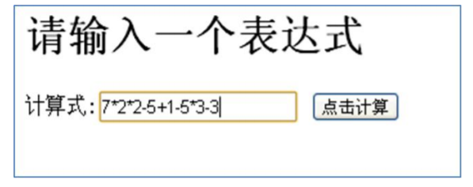
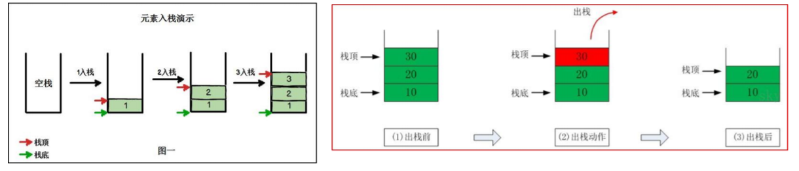
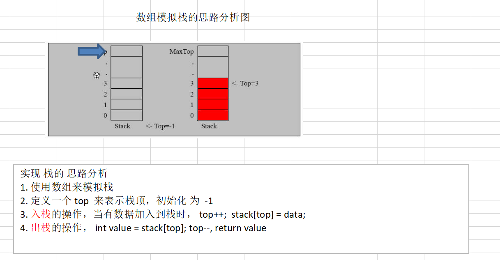

## 1、栈（stack）

[代码路径：https://github.com/xiangyuqi22/java_study/tree/master/java/algorithm/src/main/java/com/study/algorithm/stack](https://github.com/xiangyuqi22/java_study/tree/master/java/algorithm/src/main/java/com/study/algorithm/stack)

### 1、栈的一个实际需求



计算机底层是如何得到结果的？注意不是简单的把算式列出运算，因为我们看这个算式《7X2X2-5》，但是计算机怎么理解这个算式（对于计算机而言，它接收到的就是一个字符串）。我们讨论的是这个问题》栈

### 2、栈的介绍

1. 栈的英文为：stack
2. 栈是一个**先入后出(FILO-First In Last Out)**的有序列表。
3. 栈(stack)是限制线性表中元素的插入和删除只能在线性表的同一端进行的一种 特殊线性表，允许插入和删除的一端为**变化的一端，称为栈顶(top)**，另一端为**固定的一端，称为栈底(bottom)**。
4. 根据栈的定义可知，最先放入栈中元素在栈底，最后放入的元素在栈顶。而删除元素刚好相反，最后放入的元素最先删除，最先放入的元素最后删除。**即从栈顶开始删除**
5. 图解方式说明出栈(pop)和入栈(push)的概念



### 3、栈的应用场景

1. 子程序调用：在跳往子程序前，会先将下个指令的地址存到堆栈中，直到子程序执行完后再将地址取出，以回到原来的程序中。
2. 处理递归调用：和子程序的调用类似，只是除了储存下一个指令的地址外，也将参数，区域变量等数据存入堆栈中。
3. 表达式的转换【**中缀表达式转后缀表达式**】与求值
4. 二叉树的遍历


## 2、数组模拟栈




## 3、栈的使用

### 1、前缀表达式

```
前缀表达式(波兰表达式)

前缀表达式又称波兰式，前缀表达式的运算符位于操作数之前
举例说明： (3+4)×5-6 对应的前缀表达式就是 - × + 3 4 5 6
```


### 1、中缀表达式

```
中缀表达式

中缀表达式就是常见的运算表达式，如(3+4)×5-6

中缀表达式的求值是我们人最熟悉的，但是对计算机来说却不好操作(前面我们讲的案例就能看的这个问题)，因此，在计算结果时，往往会将中缀表达式转成其它表达式来操作(一般转成后缀表达式.)

```


### 2、后缀表达式

又称逆波兰表达式

```
后缀表达式

后缀表达式又称逆波兰表达式,与前缀表达式相似，只是运算符位于操作数之后

中举例说明： (3+4)×5-6 对应的后缀表达式就是 3 4 + 5 × 6 –

再比如:
```

| 正常的表达式 | 逆波兰表达式  |
| ------------ | ------------- |
| a+b          | a b +         |
| a+(b-c)      | a b c - +     |
| a+(b-c)*d    | a b c – d * + |
| a+d*(b-c)    | a d b c - * + |
| a=1+3        | a 1 3 + =     |

```
后缀表达式的计算机求值

从左至右扫描表达式，遇到数字时，将数字压入堆栈，遇到运算符时，弹出栈顶的两个数，用运算符对它们做相应的计算（次顶元素 和 栈顶元素），并将结果入栈；重复上述过程直到表达式最右端，最后运算得出的值即为表达式的结果

例如: (3+4)×5-6 对应的后缀表达式就是 3 4 + 5 × 6 - , 针对后缀表达式求值步骤如下:

从左至右扫描，将3和4压入堆栈；
遇到+运算符，因此弹出4和3（4为栈顶元素，3为次顶元素），计算出3+4的值，得7，再将7入栈；
将5入栈；
接下来是×运算符，因此弹出5和7，计算出7×5=35，将35入栈；
将6入栈；
最后是-运算符，计算出35-6的值，即29，由此得出最终结果	

```


### 3、中缀转后缀


```

后缀表达式适合计算式进行运算，但是人却不太容易写出来，尤其是表达式很长的情况下，因此在开发中，我们需要将 中缀表达式转成后缀表达式。

具体步骤如下:
初始化两个栈：运算符栈s1和储存中间结果的栈s2；
从左至右扫描中缀表达式；
    遇到操作数时，将其压s2；
    遇到运算符时，比较其与s1栈顶运算符的优先级：
    如果s1为空，或栈顶运算符为左括号“(”，则直接将此运算符入栈；
    否则，若优先级比栈顶运算符的高，也将运算符压入s1；
    否则，将s1栈顶的运算符弹出并压入到s2中，再次转到(4-1)与s1中新的栈顶运算符相比较；	

举例说明:
将中缀表达式“1+((2+3)×4)-5”转换为后缀表达式的过程如下
因此结果为 
"1 2 3 + 4 × + 5 –"
```


| 扫描到的元素 | s2(栈底->栈顶)        | s1 (栈底->栈顶) | 说明                               |
| ------------ | --------------------- | --------------- | ---------------------------------- |
| 1            | 1                     | 空              | 数字，直接入栈                     |
| +            | 1                     | +               | s1为空，运算符直接入栈             |
| (            | 1                     | + (             | 左括号，直接入栈                   |
| (            | 1                     | + ( (           | 同上                               |
| 2            | 1 2                   | + ( (           | 数字                               |
| +            | 1 2                   | + ( ( +         | s1栈顶为左括号，运算符直接入栈     |
| 3            | 1 2 3                 | + ( ( +         | 数字                               |
| )            | 1 2 3 +               | + (             | 右括号，弹出运算符直至遇到左括号   |
| ×            | 1 2 3 +               | + ( ×           | s1栈顶为左括号，运算符直接入栈     |
| 4            | 1 2 3 + 4             | + ( ×           | 数字                               |
| )            | 1 2 3 + 4 ×           | +               | 右括号，弹出运算符直至遇到左括号   |
| -            | 1 2 3 + 4 × +         | -               | -与+优先级相同，因此弹出+，再压入- |
| 5            | 1 2 3 + 4 × + 5       | -               | 数字                               |
| 到达最右端   | **1 2 3 + 4 × + 5 -** | 空              | s1中剩余的运算符                   |

